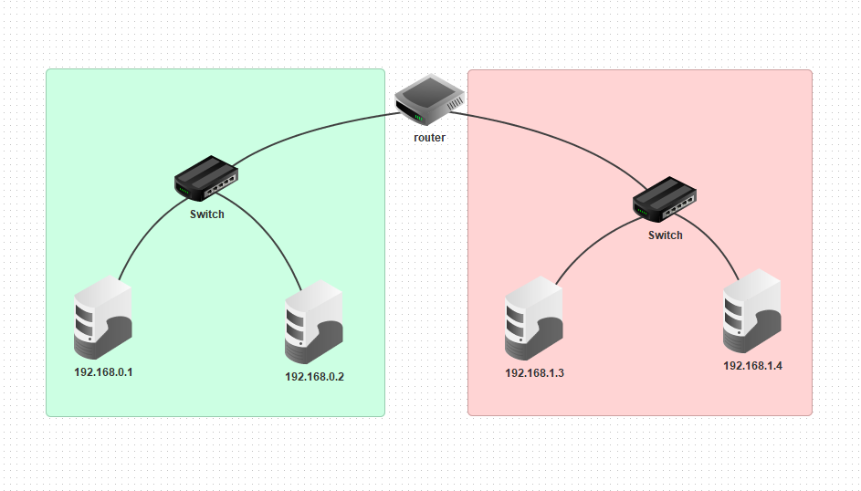

# Subnetting

#### Il Subnetting si basa nel suddividere una rete in più sottoreti, infatti in questo esercizio abbiamo simulato una sottorete.
#### La prima cosa da fare e e creare due reti collegate ad un router come nella foto qui sotto

