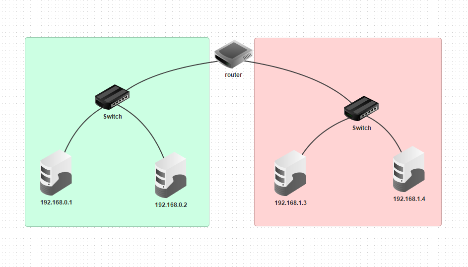
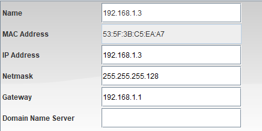
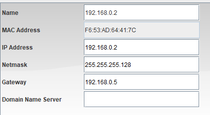

# Subnetting

#### Il Subnetting si basa nel suddividere una rete in più sottoreti, infatti in questo esercizio abbiamo simulato una sottorete.
#### La prima cosa da fare e e creare due reti collegate ad un router come nella foto qui sotto

#### Fatto questo bisogna creare le sottoreti, per fare questo esercizio bisogna cambiare le subnet mask delle due reti, infatti come potete vedere nell'immagine la subnetmask è "255.255.255.128" 

  #### Questa è la configurazione del PC di una rete

  #### Questa è la configurazione del PC dell'altra rete

